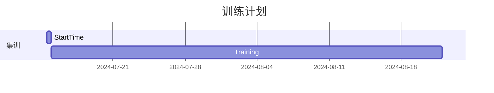

时间: 2024-07-14~2024-08-21

```mermaid
gantt
        dateFormat HH:mm
        axisFormat %H:%M
        8：30打卡 : milestone, m1, 08:30,0min
        2.5h训练 : 2.5h
        11：00上午结束 : milestone , m4,11:00 , 0min
        13：30下午开始 : milestone , m2 , 13:30 ,0min
        3.5h训练 : 3.5h
        17：00结束 : milestone, m3, 17:00, 0min

```


```contributionGraph
title: Contributions
graphType: calendar
dateRangeValue: 180
dateRangeType: FIXED_DATE_RANGE
startOfWeek: 1
showCellRuleIndicators: true
titleStyle:
  textAlign: center
  fontSize: 30px
  fontWeight: normal
dataSource:
  type: PAGE
  value: "#acm"
  dateField: {}
  countField:
    type: DEFAULT
fillTheScreen: true
enableMainContainerShadow: false
fromDate: 2024-07-15
toDate: 2024-08-21
cellStyleRules:
  - id: Lovely_a
    color: "#fedcdc"
    min: 1
    max: 2
    text: "🤬"
  - id: Lovely_b
    color: "#fdb8bf"
    min: 2
    max: 3
  - id: Lovely_c
    color: "#f892a9"
    min: 3
    max: "4"
  - id: Lovely_d
    color: "#ec6a97"
    min: "4"
    max: "5"
  - id: 1721093942822
    min: "5"
    max: "6"
    color: "#d300ffff"
    text: ""
  - id: 1721093963729
    min: "6"
    max: "999"
    color: "#6200ffff"
    text: "🤯"
cellStyle:
  minWidth: 14px
  minHeight: 14px

```
## 知识整理
1、 [[0-1 背包问题 Knapsack Problem]]
2、[[0-2-1 深度优先算法 Depth First Search]]
3、[[0-2-2 深度优先算法（岛屿问题）]]
4、[[0-3 马走日]]

## 错题整理
1、[[Divide it!]]
2、[[Sum of Suffix Sums]]
3、[[a Bit Common]]

## 书本资料
1、[[数据结构教程-第一章笔记整理]]
2、[[数据结构教程-第三章笔记整理]]

## 周日讲座
1、[[集训队讲座-01]] 2024-07-20